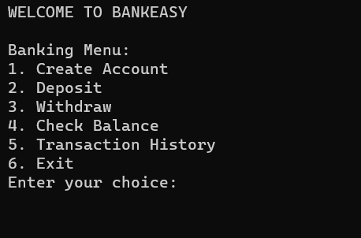

# Bankeasy-cppdsmp

This is a C++ console application for a simple banking system called "BankEasy." The application allows users to create bank accounts, make deposits, withdrawals, check account balances, and view transaction histories. Below is an overview of the main components of this application:

## Classes
Transaction: This class represents a single transaction and has two constructors: a default constructor and a parameterized constructor, allowing you to create transactions with an amount and a type (e.g., "Deposit" or "Withdrawal").

## BankAccount:
The BankAccount class represents a bank account. It includes properties like account number, account holder name, balance, and an array of transactions. It has methods for depositing, withdrawing, checking the balance, and displaying transaction history. The class also provides default and parameterized constructors.

## Functions
createAccount: A function to create a new bank account and add it to an array of bank accounts. It checks the account limit before adding a new account.

findAccount: A function to find a bank account by its account number in the array of bank accounts. It returns a pointer to the account if found, or NULL if not found.

Main Function
The main() function is the entry point of the application. It provides a menu-driven interface for users to perform various banking operations, including account creation, deposit, withdrawal, balance check, and transaction history viewing. It also allows users to exit the application.

## Usage
Create an account with a predefined account number, account holder name, and initial balance using the createAccount function.
Use the menu options to perform various banking operations.
View transaction history and account balance.
Exit the application when done.
Note: The application can handle up to 100 bank accounts and keeps a transaction history for each account.

### Enjoy using BankEasy!

  

 
